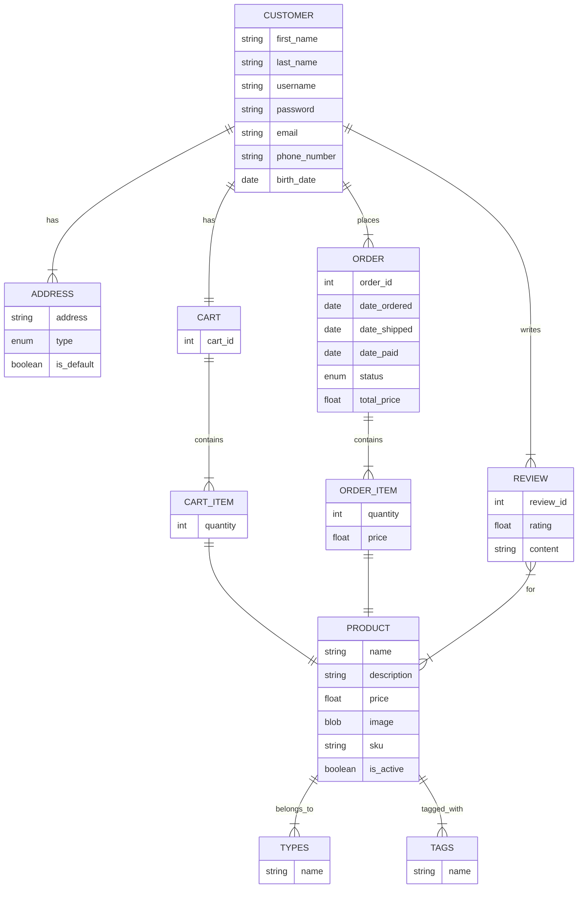

```mermaid
erDiagram


CUSTOMER {
    string first_name
    string last_name
    string username
    string password
    string email
    string phone_number
    date birth_date
}

CUSTOMER ||--|{ ADDRESS : has
CUSTOMER ||--|{ ORDER : places
CUSTOMER ||--|| CART : has
CUSTOMER ||--|{ REVIEW : writes

ADDRESS {
    string address
    enum type 
    boolean is_default
}

CART {
    int cart_id
}

CART ||--|{ CART_ITEM : contains
CART_ITEM {
    int quantity
}

CART_ITEM ||--|| PRODUCT : ""

ORDER {
    int order_id
    date date_ordered
    date date_shipped
    date date_paid
    enum status
    float total_price
}

ORDER ||--|{ ORDER_ITEM : contains
ORDER_ITEM {
    int quantity
    float price
}

ORDER_ITEM ||--|| PRODUCT : ""

PRODUCT {
    string name
    string description
    float price
    blob image
    string sku
    boolean is_active
}

PRODUCT ||--|{ TYPES : belongs_to
TYPES {
    string name
}

PRODUCT ||--|{ TAGS : tagged_with
TAGS {
    string name
}

REVIEW {
    int review_id
    float rating
    string content
}

REVIEW }|--|{ PRODUCT: "for"

```