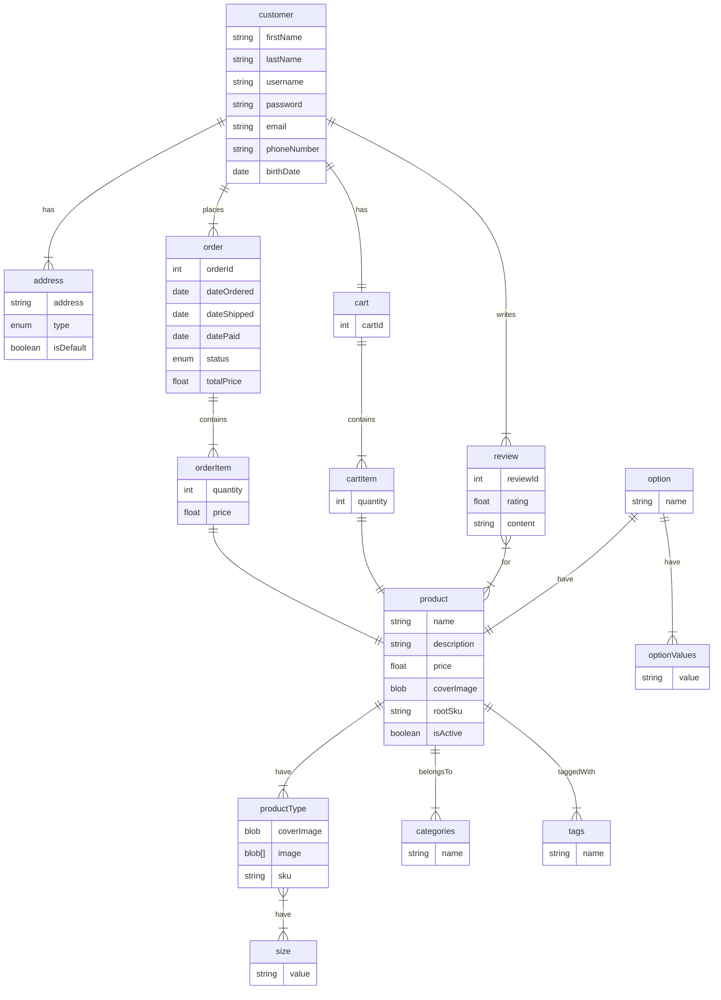

```mermaid
erDiagram

customer {
    string firstName
    string lastName
    string username
    string password
    string email
    string phoneNumber
    date birthDate
}

customer ||--|{ address : has
customer ||--|{ order : places
customer ||--|| cart : has
customer ||--|{ review : writes

address {
    string address
    enum type
    boolean isDefault
}

cart {
    int cartId
}

cart ||--|{ cartItem : contains
cartItem {
    int quantity
}

cartItem ||--|| product : ""

order {
    int orderId
    date dateOrdered
    date dateShipped
    date datePaid
    enum status
    float totalPrice
}

order ||--|{ orderItem : contains
orderItem {
    int quantity
    float price
}

orderItem ||--|| product : ""

product {
    string name
    string description
    float price
    blob coverImage
    string rootSku
    boolean isActive
}

product ||--|{ productType : have
productType{
    blob coverImage
    blob[] image
    string sku
}

productType }|--|{ size : have
size{
    string value
}

product ||--|{ categories : belongsTo
categories {
    string name
}

product ||--|{ tags : taggedWith
tags {
    string name
}

option ||--|| product : have

option {
    string name
}

option ||--|{ optionValues : have

optionValues {
    string value
}

review {
    int reviewId
    float rating
    string content
}

review }|--|{ product : "for"

```